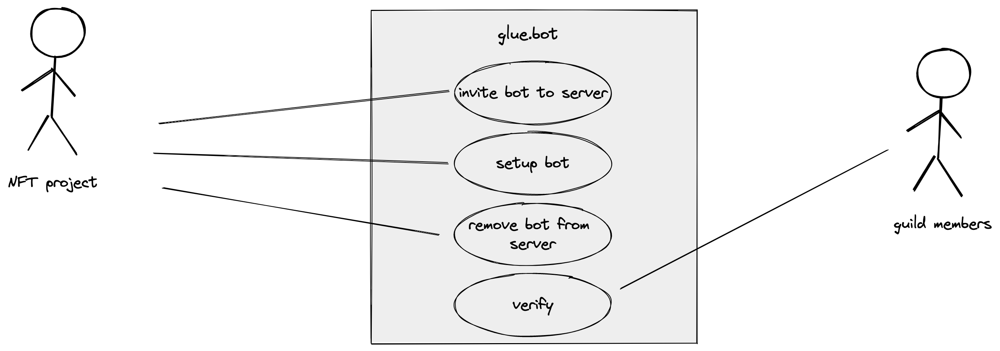

# development 👷‍♀️

## prerequisites

-   [`poetry`](https://python-poetry.org/)
-   `python ^3.10` (you can use [pyenv](https://github.com/pyenv/pyenv#installation) to manage multiple versions of python)
-   `.env` file in `/glue` with the following entries:

    -   DISCORD_TOKEN
        -   your discord bots token
    -   FRONTEND_URL
        -   the url the frontend that users interact with lives at. use the hostname of your local deployment of the [glue](https://github.com/glue-org/glue) frontend for development and `https://<frontend-canister-id>.ic0.app` for production

## local deployment

-   run `poetry install` to install all dependencies
-   run `poetry run python glue/main.py` from the _root of this repository_ to start the bot

## deploying to production

-   you can run the bot within a [`screen`](https://linuxize.com/post/how-to-use-linux-screen/) session on your server

# requirement analysis

## use case diagram

## invite bot to server

Owners of a discord server can invite the bot to their server. The bot can be invited to multiple servers. As soon as the bot is part of the channel, it can be setup using slash commands.

## setup bot

Users on the the server that have the general admin role can setup the bot. This way they can give a role to people that hold a certain NFT. They will need to specify the NFT standard, the canister principal, the name of the project and the role they want to give to verified users. The setup takes place using slash bot commands.

## remove bot

Admins can remove the bot from the server. This won't delete the channels or roles created by the bot. It will also not take away token holder roles from users.

## verify

Guild members can verify their assets with the bot by clicking on the link generated by the bot and put in a public channel by the server owner. When visiting the website the user has to login with their discord account. After that the user has to send a message to a canister to prove that she owns a specific principal. The bot will then check if the principal holds NFTs of the NFT canister it is setup for. If this is the case, the "token granted role" will be assigned.

